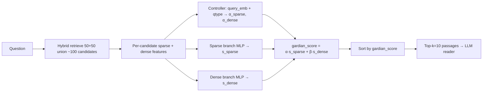

# RQ4 — End-to-end impact of GARDIAN re-ranking

**Research question:** Does improved re-ranking reduce unsupported claims and improve answer accuracy and citation metrics in full RAG pipelines with strong general-purpose and biomedical LLM readers?

This document ties together `scripts/03_generate_rank_data.py`, `scripts/04_train_gardian.py`, the **GARDIAN** model, and `scripts/06_end_to_end_qa.py`.

---

## What GARDIAN is (and is not)

### Pipeline (training → deployment)



| Stage | Script / module | What happens |
|--------|------------------|--------------|
| **Rank data** | `03_generate_rank_data.py` | For each QA item: hybrid `retrieve()` → up to **100** candidates; label **positive** iff `pid ∈ gold_passage_ids`; store sparse/dense features + scores. |
| **Train** | `04_train_gardian.py` | **Pairwise BCE** on (pos, neg) pairs; dev metric **nDCG@10**; saves `results/gardian_best_<hybrid_family>.pt`. |
| **Model** | `src/model/gardian.py` | Text-only **re-ranker** (not a reader): controller + two branch MLPs; `rerank()` writes `gardian_score` and α weights. |
| **E2E QA** | `06_end_to_end_qa.py` + `qa_eval.py` | Same **union pool** for all systems → **Hybrid** takes top-10 by **RRF**; **GARDIAN** takes top-10 by **gardian_score** → same reader. |

### What GARDIAN is **not**

- Not a replacement for BM25 / FAISS / SPLADE++ / MedCPT — those build the pool.
- Not trained to maximize yes/no accuracy or citation F1 — trained for **ranking** gold evidence in the pool.
- Not guaranteed to beat Hybrid on **every** E2E metric; the reader adds noise and task shift.

### RQ4 contrast (fair)

| System | Same pool? | Reader top-k selection |
|--------|------------|-------------------------|
| **hybrid** | Yes (~100 union) | Top-10 by `hybrid_rrf_score` (RRF k=60) |
| **gardian** | Yes | Top-10 by `gardian_score` after `model.rerank()` |
| sparse / dense | Yes | Channel ablation: top-10 by sparse or dense score **within the shared pool** |

Config locks this: `hybrid_balanced_top_k: false`, `rq4_align_retrieval_top_k: true`, `rq4_full_union_pool: true`, `top_k_passages: 10`.

---

## Metrics for RQ4 (what to report)

### Primary (answer the RQ directly)

| Metric | Dataset | Direction | GARDIAN can beat Hybrid when… |
|--------|---------|-----------|--------------------------------|
| **Answer accuracy** | PubMedQA-Labeled, MedMCQA | Higher | Rerank puts evidence the reader uses into top-10. |
| **Unsupported claim rate** | PubMedQA-Labeled only | **Lower** | Fewer `[P#]` tags point at non-gold passage IDs. |
| **Citation precision** | PubMedQA-Labeled | Higher | More cited slots hit `gold_passage_ids`. |
| **Citation recall** | PubMedQA-Labeled | Higher | More gold sentences receive a `[P#]` cite. |
| **Supported citation rate** | PubMedQA-Labeled | Higher (= 1 − unsupported on cites) | Same as precision-focused view. |

MedMCQA: report **accuracy only** (gold explanation IDs ≠ retrieved `[P#]` targets).

### Secondary (retrieval–QA bridge — strongly recommended)

| Metric | Meaning |
|--------|---------|
| **Gold evidence in context rate** (`gold_evidence_in_context_rate`) | Share of `gold_passage_ids` that appear in the **reader’s top-10**. If GARDIAN beats Hybrid here, accuracy/citation gains are **expected**, not surprising. |
| Offline **Hit@10 / nDCG@10 / MRR** | `05_evaluate_gardian.py` on rank JSONL — same pool, full-list rerank. |

### Do **not** over-claim

- **Dense-only** RAG often has the **lowest** unsupported rate (citations align with gold IDs) while **GARDIAN** can still win **accuracy** — different objectives.
- **Sparse/dense rows** in E2E are **not** standalone corpus retrievers; they are channel picks from the **shared** pool.
- Old QA JSONs with **6 passages**, `hybrid_balanced_top_k`, or **adaptive-only pools** are **invalid** for RQ4.

---

## Correct E2E command (paper-scale)

```bash
.venv/bin/python scripts/06_end_to_end_qa.py \
  --rq4 \
  --online-retrieval --pubmedqa-open-domain \
  --gardian-adaptive-retrieval \
  --checkpoint-every-dataset \
  --datasets pubmedqa_labeled,medmcqa \
  --max-questions 500 \
  --retriever hybrid_spladepp_medcpt \
  --reader-models Qwen/Qwen2.5-32B-Instruct \
  --load-in-4bit --faiss-cpu \
  --top-k-passages 10 \
  --fresh \
  --out results/qa_hybrid_spladepp_medcpt_Qwen32B_n500_v3.json
```

**Log checklist (must appear before questions):**

```text
RQ4 protocol: top_k=10 | hybrid_balanced=False | rq4_align=True | rq4_full_union_pool=True | pool=full_union_rrf
QA reader top-k=10 | hybrid_balanced=False | rq4_align_retrieval=True | pool=full_union_rrf
```

**Index alignment:** Rank data (`03`) default `--mode per-corpus` must match live QA (`use_per_dataset_indices: true`). Use `--unified-indices` only if rank JSONL was built with `--mode unified`.

**Re-run retrieval table** after `rank_jsonl_eval.py` full-pool fix:

```bash
.venv/bin/python scripts/05_evaluate_gardian.py --retriever hybrid_spladepp_medcpt
```

---

## Honest paper wording (RQ4)

> We evaluate end-to-end RAG with top-$k{=}10$ passages from a shared hybrid candidate pool ($\sim$100 documents). The **hybrid** baseline selects passages by reciprocal rank fusion; **GARDIAN** re-ranks the same pool with a learned query-adaptive fusion of sparse and dense features. On PubMedQA-Labeled we report answer accuracy, citation precision/recall, and the fraction of citations to non-gold evidence (unsupported claim rate). On MedMCQA we report accuracy only. Improved re-ranking is **expected** to help when it increases gold evidence in the reader context; we report **gold evidence in context rate** as a diagnostic linking retrieval gains to E2E outcomes.

---

## Related

- Protocol bugs and fixes: `docs/GARDIAN_RERANK_AUDIT.md`
- Tests: `tests/test_qa_reader_top_k.py`
